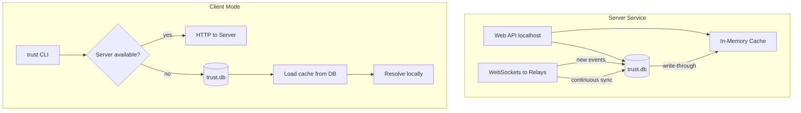

# NIP-32010 Implementation Overview

## Purpose

The **Trust CLI** implements [NIP-32010](../nips/NIP-32010.md) (Digital Web of Trust Reputation) to handle trust assertions on Nostr. Users can **issue** trust events (kind 32010) and **query** reputation for any target—identity, event, content hash, URL, or NIP-73 external content ID.

## Goals

1. **Issue trust** – Publish signed kind 32010 events to Nostr relays with subject (`p`, `e`, `a`, `h`, `r`, `i`/`k`), context (`c`), and value (`v`).
2. **Regular sync** – Efficiently synchronize with Nostr relay servers using configurable subscription strategies (subscribe-all vs graph-based subsets) to avoid downloading irrelevant trust events.
3. **Local resolve** – Use a local SQLite database plus in-memory cache and configurable loading strategies so that resolution only needs the part of the global trust graph that is relevant for the current client.

## Features

| Feature | Description |
|---------|-------------|
| Issue trust | Create and publish trust (1), distrust (-1), or neutral (0) assertions on pubkeys, events, content hashes, URLs, or NIP-73 IDs |
| Batch trust | Issue multiple subjects in a single event (e.g. distrust a botnet) |
| Local DB | Persist kind 32010 events in SQLite for quick reputation resolution |
| Relay sync | Incrementally fetch new trust events and update local DB |
| Context filtering | Filter by context (`development`, `commerce`, `security`, etc.) |
| NIP-73 support | Trust on ISBN, DOI, podcast GUIDs, blockchain tx/address, and other external IDs |
| Query reputation | Resolve a target (npub, event ID, URL, etc.) and show aggregated trust from followed/trusted authors |

## Scope (In / Out)

**In scope:**
- Issue single and batch trust events
- Query and sync trust events from relays (author-focused or target-focused)
- Local DB schema for trust events and reputation queries
- Resolve reputation from local DB for a target
- All subject types: `p`, `e`, `a`, `h`, `r`, `i`+`k`

**Out of scope (for initial implementation):**
- Full graph-based reputation scoring (weighted paths from user)
- Integration with follow graph (kind 3) for "trusted authors"
- Implementing additional sync event kinds defined in NIP-32011 and NIP-32012 (these NIPs are documented but their event kinds are wired in only after the efficient resolve/sync strategies below are implemented)

**Phase 2 adds (see below):**
- Server mode (Web API, websockets to relays)
- Client delegation to server
- Cache-backed DB for searches

## Resolve & Synchronization Strategies

To keep relay traffic and local resource usage manageable, the implementation supports pluggable strategies at two layers: **relay subscription** and **memory cache loading**. The goal is that the client does **not** need to download all global trust events, only those that matter for its current web-of-trust graph.

### Relay subscription strategies

- **Subscribe-all (filter on client side)**:  
  Subscribe to all trust events (kind 32010; later extended to additional sync-related kinds from NIP-32011 and NIP-32012). The client then filters events locally based on its own trust graph and query context. This is simple and robust but can mean a very large subscription and higher bandwidth usage on busy relays.

- **Graph-based subset (trusted npubs only)**:  
  Build the user's current web-of-trust graph from the `trust` table and subscribe only to events authored by npub keys that are in, or on the frontier of, that graph. This dramatically reduces the number of events the client needs to download, at the cost of more complex graph maintenance and a risk of missing events from currently unknown authors.

- **Runtime-selectable**:  
  The chosen strategy is **optional and switchable on the fly** (e.g. via CLI flags or config). If a graph-based strategy behaves poorly for a very large graph or a specific relay, the user can quickly fall back to the subscribe-all strategy without any database migration.

### Memory cache strategies

When using the in-memory cache to accelerate resolve operations, there are two parallel strategies:

- **Load-all cache**:  
  Load all relevant trust rows from `trust.db` into the cache, regardless of whether the corresponding identities are currently in the client's trust graph. This gives the fastest warm-up and query performance for small/medium datasets, but can bloat memory when the global dataset is large.

- **Graph-limited cache**:  
  Load only events that are in, or immediately adjacent to, the client's current trust graph. This keeps the in-memory working set smaller at the cost of slower initial loading and more on-demand DB lookups when the graph changes.

Both cache strategies reuse the same DB schema and resolution logic; they only differ in how big a subset of the global trust graph they materialize in memory.

## Phase 2: Server/Client Architecture

### Focus and split processes

- **Config:** `authors` and `contexts` in `config.json` scope what is retained (use the single token **`All`** in a one-element list when you want no filter on that axis). Omitted `authors` / `contexts` default to **all** authors and **all** contexts unless narrowed by **`--authors`** / **`--contexts`** on sync/server.
- **CLI precedence:** **`--authors`** and **`--contexts`** override `config.json` for that sync/server process when set.
- **Split processes:** `trust server --service relay` and `trust server --service api` can share one database (SQLite file or Postgres). The API process polls `trust_graph_notify` (filled by DB triggers on `nostr_events` insert/delete) to refresh the graph when the relay process writes events. **`trust sync`** writes the relay feed to the database only; the API process refreshes its graph from the DB (notify queue / triggers).

### Cache-Backed DB Layer

- **Principle:** All searches (resolve, query paths) go against the in-memory cache for speed.
- **Reads/writes:** Go to the DB and update the cache (write-through or invalidate-on-write).
- **Existing cache:** Reuse current implementation in [`src/lib/trust/trust-cache.ts`](../../src/lib/trust/trust-cache.ts) (`authorCache`, `subjectCache`, `loadTrustCache`, `getIncomingTrusts`, `getOutgoingTrusts`) without modifying it.
- **Needed code:** Add wiring so that:
  - `insertTrustEvent` (and any other DB writes) updates the cache after write.
  - Resolve/query commands use the cache for lookups by default when the app is running.
  - No change to the cache module's public API.

### Server Mode

- **CLI command:** `trust server` with options `-p/--port`, `-h/--host`, `-r/--relay`.
- **Purpose:** Run a long-lived process that keeps the cache loaded and continuously synced with relay servers.
- **Components:**
  - Web API (e.g. Express or Fastify) on localhost for:
    - Submitting new trust events (equivalent to `issue`)
    - Submitting resolve requests
  - WebSocket connections to relay servers for continuous synchronization of kind 32010 events
  - On startup: load DB into cache, then subscribe to relays via websockets; on each new event, insert to DB and update cache
- **Benefit:** Cache is always warm; resolve requests are fast and reflect live data.

### Client Mode

- **Principle:** Same app can run as server (long-lived) or client (short-lived CLI).
- **Client flow:**
  1. Check if server is available (e.g. `GET /health` or `GET /available` on localhost).
  2. **If available:** Send HTTP requests to the server (issue, resolve).
  3. **If not available:** Run the command locally.
- **Client running locally:**
  - Load DB into cache before any resolve request (same as current `loadTrustCache()` behavior when using cache strategy).

### Architecture Diagram

## References

- [NIP-32010 Specification](../nips/NIP-32010.md)
- [NIP-32011 Specification](../nips/NIP-32011.md) – additional sync-related event kinds (deferred)
- [NIP-32012 Specification](../nips/NIP-32012.md) – additional sync-related event kinds (deferred)
- [Project Description](../description.md)
- [Design Document](02-design.md) – Database, business layer, commands; Phase 2 (server mode, client mode, cache-backed DB)
- [Step-by-Step Implementation](03-step-by-step.md) – Phased implementation order
